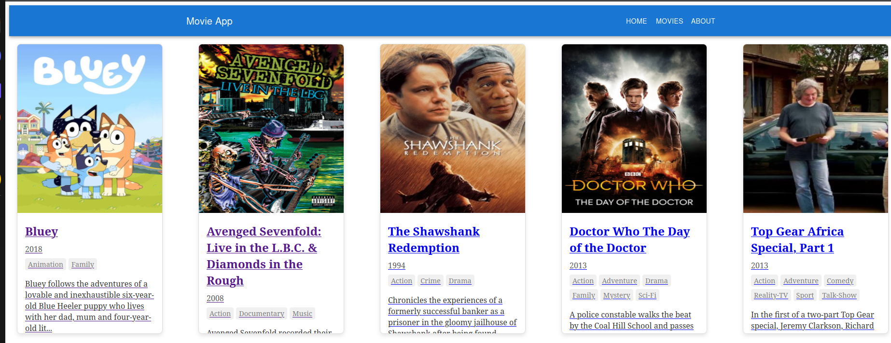
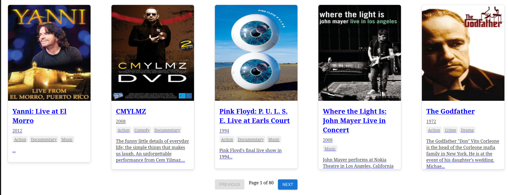
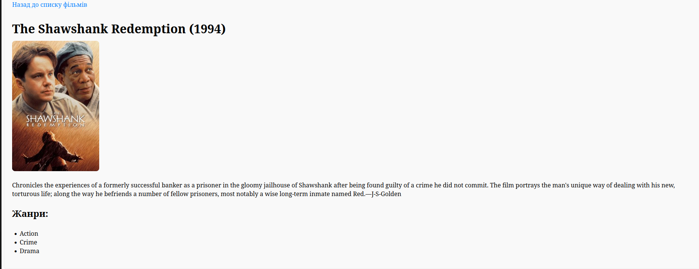
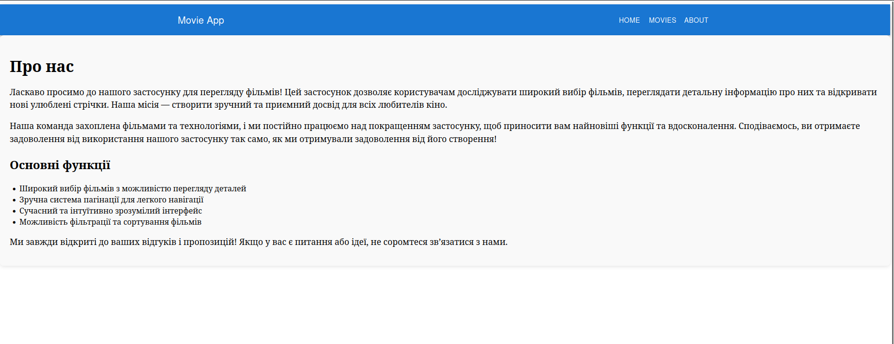

# Movie Viewing Application

Welcome to the Movie Viewing Application! This app allows users to explore a wide selection of movies, view detailed information about each one, and discover new favorites. my mission is to create a user-friendly and enjoyable experience for all movie enthusiasts.

## Features

- **Extensive Movie Library**: Browse a vast collection of movies, complete with details like title, year, genres, and a brief summary.
- **Movie Details Page**: Click on any movie to see its details, including a larger poster, a full summary, and a list of genres.
- **Pagination**: Easily navigate through the movie list with a convenient pagination system.
- **About Page**: Learn more about the app and its features on the About page.

## Screenshots

### Home Page

On the main page we can see only 10 movies.

### Movie Detail Page

You can find out information on the page with detailed information about the film.

### Movies List Page

On the page with movies, all movies are displayed, which can be viewed in parts using pagination.

### About Page

On the page about us you can find out various information.
